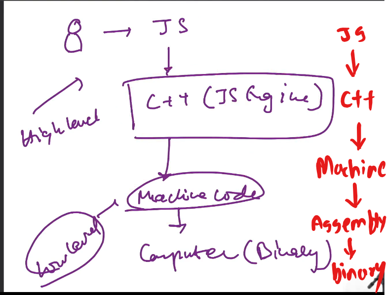

# Js On Server -:

- Js Engine => V8 (Google) => c++ program.
 - V8 Executes Js code.
 - V8 can be embeded int any c++ application.
 - Node js is a C++ Application with V8 Embedded into it
 - V8 Follow EcmaScript standard.
 

- ECMAScript -: 
 - it is standard for scripting languages include javascript jscript and actionScript.
 - ECMASCRIPT define Rules.
 - All js engines follow Ecmascript Standards.
 - 
 - 

