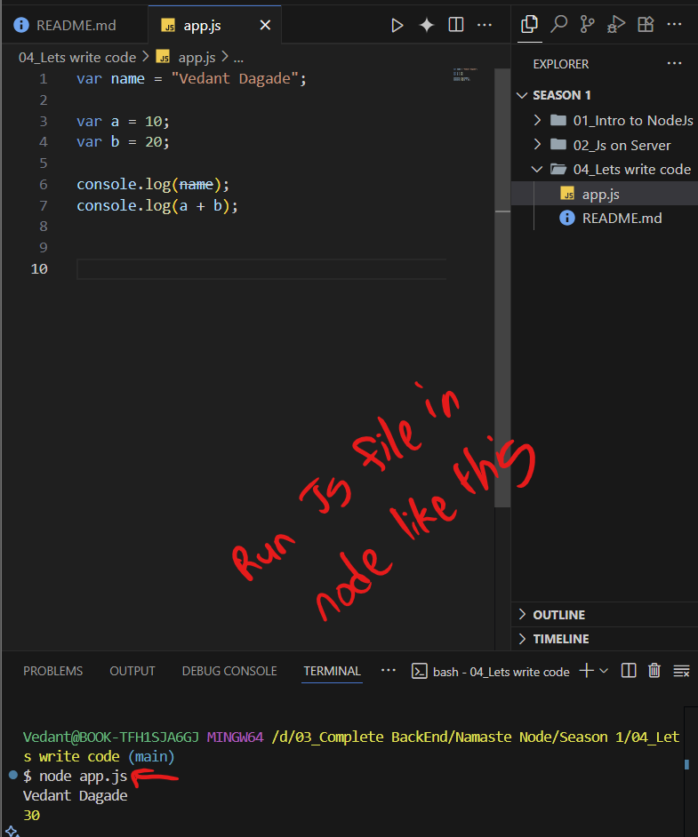
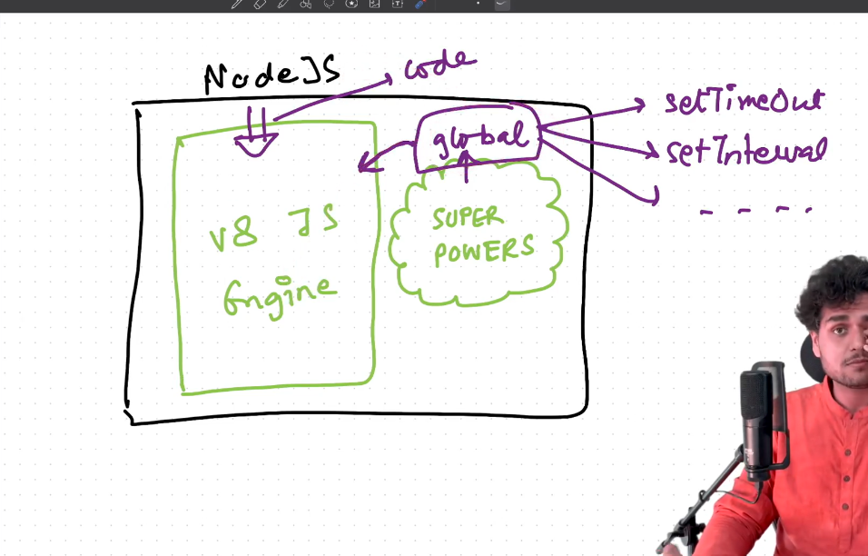
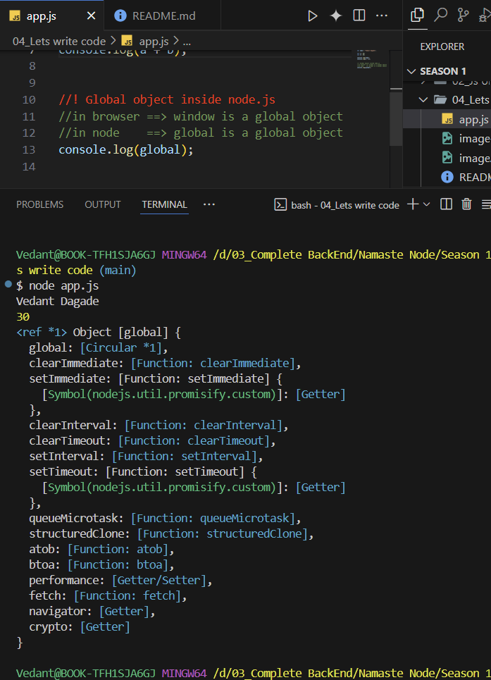

# Lets Write Code -:

- Node js is Javascript Runtime  Environment/
- 

---
- Global object inside node.js
  - in browser ==> window is a global object
  - in node    ==> global is a global object
  
  - 
  - 

  - globalThis => this is work on any where and any browser.

  
