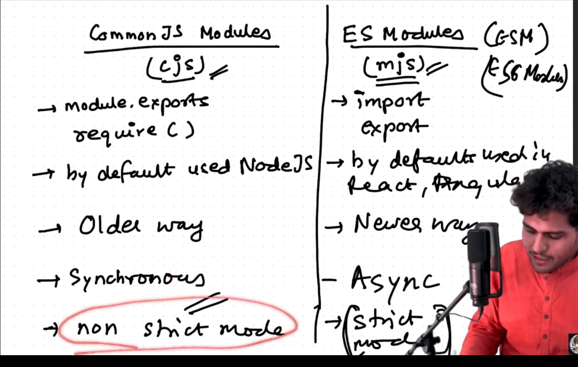
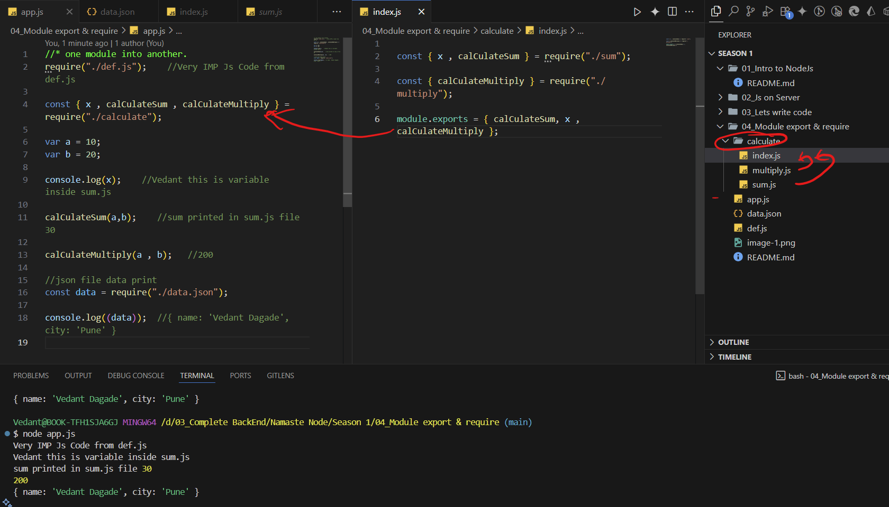

# Module , export and Require -:

---
## Common Js modules(cjs) and Es modules(mjs) -:

- 
- Common Js Modules -: mjs
 - old
 -  module.exports -: is used to transfer module
 - module.exports => initialy it is empty object {}
 - when attach propert it fill .
 - require -: used to import module.

 - 

- ES module -: ESM or mjs 
 - New
 - used import and export (react) also node

---
- 